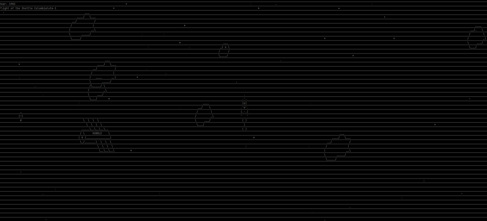

### Игра на псевдо-графике — ASCII-арт.

Запуск игры:
```
python3 run.py
```



### Правила игры:
- Игрок управляет космическим кораблем, который может двигаться вверх, вниз, влево и вправо.
- На поле присутствуют астероиды и другой мусор, который двигаются в случайном направлении.
- Игрок должен уворачиваться от объектов, которые движутся по полю.
- После 2020 года, у вас появится возможность стрелять по комическому мусору, но это не точно.)